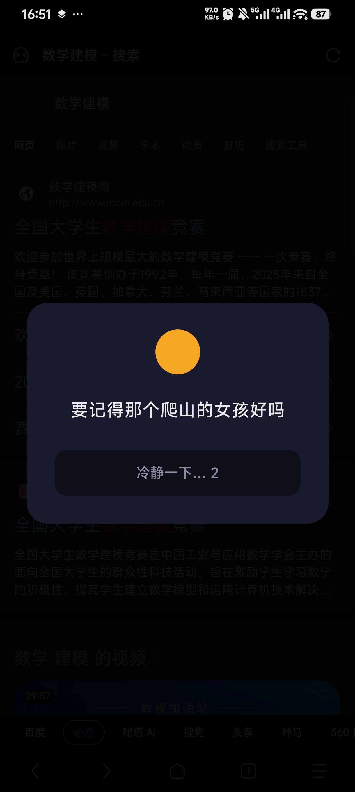
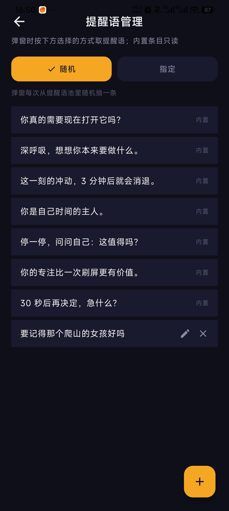
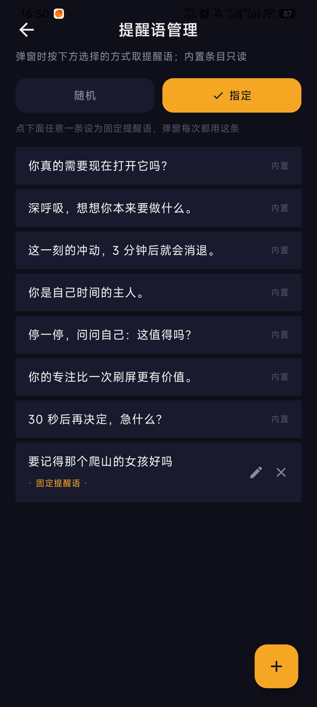
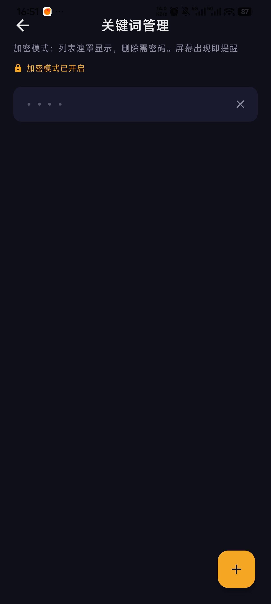
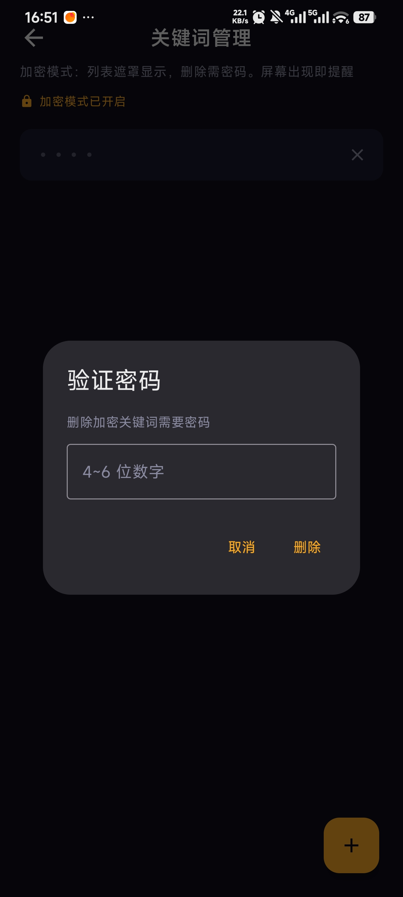
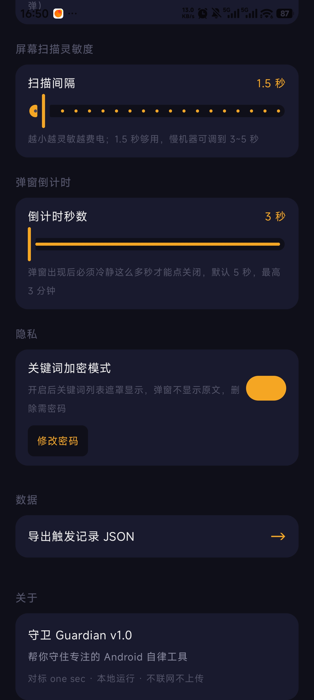

# 守卫 Guardian

> Android 自律工具。打开指定 App、或打出你设定的关键词时，弹"停顿点"悬浮窗让你冷静一下再决定。退出永远免费，反复选择继续才会被封锁。

## 它怎么工作

1. 打开被监控的应用、或在输入框里打出关键词 → 弹出停顿点，先冷静几秒（默认 5 秒，越继续越久）
2. 两个选择：**「退出」随时可点、永远免费**；「继续」要等停顿结束，点了记一次、放行 5 分钟不再打扰
3. 30 分钟内第 3 次选择继续 → 送回桌面，并把那个应用封锁 3 分钟，期间打开就被送回来
4. 不做决定直接离开（按 Home、锁屏）也免费——走人不该被惩罚，留下才有代价

三档强度一键切换：**温和**（只提醒不封）/ **标准**（上面这套）/ **严格**（每次只放行 3 分钟，第 2 次继续就封 10 分钟）。高级参数全部可调。

## 功能

- **App 触发**：勾选要监督的应用（抖音、微博、B 站……），打开即弹停顿点
- **关键词触发**：设置关键词，默认只在你**自己打出来**时触发；别人发来的、页面上出现的不算（可切成整屏匹配）
- **通行证与封锁**：只有你点「继续」才计数；反复继续才封锁；封锁状态持久化，杀进程重启都绕不过
- **紧急出口**：封锁期间真的必须用（付钱、打车、回消息）→ 点「紧急解除封锁」，等 5 秒、输了密码就解开，会记一笔
- **失信惩罚**：点了「退出」却赖着不走 → 按「继续」记一次
- **拦下率统计**：每次停顿你选了什么都记下来——退出 / 离开 / 继续 / 封锁，7 天 / 30 天堆叠趋势图，最常触发的应用
- **关键词加密模式**：列表遮罩显示，弹窗不显示原文，删除和导出都要密码——适合你想"忘掉"的关键词
- **提醒语**：随机抽 / 固定一条，可自定义
- **暂停与时段**：出差开会一键暂停一会；或只在工作日上班时间 / 每晚睡前守护。暂停和时段外不弹不计数，但已生效的封锁照旧
- **体感提醒**：振动 + 提示音（默认跟随系统静音，"静音也响"可选）
- **权限守护**：运行中权限被系统收回会发通知，不会静默失效
- **本地运行**：不联网不上传，所有数据只在本地；导出 JSON 随你处置

## 截图

> v1.2 界面已全面重做，截图待更新。

| 停顿弹窗 · 触发实拍 | 提醒语 · 随机模式 | 提醒语 · 指定模式 |
|:---:|:---:|:---:|
|  |  |  |

| 关键词 · 加密遮罩 | 删除需验证密码 | 设置 |
|:---:|:---:|:---:|
|  |  |  |

## 下载安装

### 方式一：直接下载 APK

去 [Releases](../../releases) 下载 `app-debug.apk`，手机允许"未知来源"后点击安装。

### 方式二：自己编译

```bash
git clone https://github.com/sgy1023-crt/Guardian.git
cd Guardian
./gradlew assembleDebug
adb install -r app/build/outputs/apk/debug/app-debug.apk
# 小米被 INSTALL_FAILED_USER_RESTRICTED 拒绝时（USB 安装开关未开）：
# adb push app/build/outputs/apk/debug/app-debug.apk /data/local/tmp/g.apk && adb shell pm install -r /data/local/tmp/g.apk
```

要求：JDK 17、Android SDK（compileSdk 35、minSdk 26）、Android 8.0+ 真机。

## 权限说明

| 权限 | 用途 |
|------|------|
| `PACKAGE_USAGE_STATS` | 检测当前前台 App（需手动授权） |
| `SYSTEM_ALERT_WINDOW` | 在其他 App 之上弹悬浮窗 |
| `BIND_ACCESSIBILITY_SERVICE` | 读取你正在输入的文字匹配关键词；封锁时把你送回桌面 |
| `FOREGROUND_SERVICE` + `_SPECIAL_USE` | 常驻后台检测 |
| `POST_NOTIFICATIONS` | 前台服务通知、权限异常通知（Android 13+） |
| `RECEIVE_BOOT_COMPLETED` | 开机自启 |
| `REQUEST_IGNORE_BATTERY_OPTIMIZATIONS` | 关闭电池优化保活 |
| `QUERY_ALL_PACKAGES` | 列出已安装 App 供勾选 |
| `VIBRATE` | 弹窗振动 |

所有数据只在本地（Room 数据库 + SharedPreferences），不联网不上传。

## 首次使用

1. 安装后打开，走完 5 步权限引导（前两步必须，无障碍强烈建议——没有它封锁只能挡一堵墙，不能送你回桌面）
2. 「规则」页勾选要监督的应用、加关键词
3. 「设置」页选一档强度（默认标准）
4. 回「守护」页打开总开关

## 小米/HyperOS 注意事项

> 小米系统的两个坑，按这个顺序处理才能正常工作：

1. **覆盖安装失败**：如果之前装过老版本且无障碍绑定没清，`adb install` 会显示 "Success" 但实际没装进去。**先在桌面长按图标卸载老版本，再装新版。**
2. **无障碍绑定状态不对齐**：装完进 系统设置 → 无障碍 → 守卫，**先关掉，等 2 秒，再打开**。HyperOS 已知 bug，开关显示"开"但实际未绑定。

## 技术栈

- Kotlin 2.0.21 · Jetpack Compose（Material3，BOM 2024.12.01）· Room 2.6.1
- AGP 8.13.2 / Gradle 8.13 · minSdk 26 / targetSdk 35
- 两个监控引擎（UsageStatsManager 前台轮询 + AccessibilityService 输入框文本扫描）共用一个决策中心

## 架构

```
引擎 1：前台 App 检测          MonitorService.kt · 1s 轮询 UsageStatsManager.queryEvents
引擎 2：输入文字扫描           ClipboardWatcherService.kt · 轮询 rootInActiveWindow，默认只收可编辑节点
          ↓ 该不该弹
决策中心：InterventionCoordinator + EscalationTracker
          通行证 / 「继续」计数 / 递增停顿 / 封锁 / 退出宽限 / 失信
          状态持久化在 EscalationStore（独立 SharedPreferences）
          ↓
悬浮窗：OverlayController（进程内单例）· 停顿窗两按钮 · 封锁窗两态（已踢回告知卡 / 未踢回"墙"）
数据：Room v2（MonitoredApp / Keyword / Reminder / TriggerLog + decision）
保活：ForegroundService + WorkManager + BootReceiver
```

## 路线图

- [x] App 触发 / 关键词触发
- [x] 通行证 + 决定计数 + 递增停顿 + 升级封锁（v1.2 重做，修掉"时间流逝也算挣扎"的死循环）
- [x] 拦下率统计 + 数据导出
- [x] 三档强度预设
- [x] 关键词加密模式
- [x] 开机自启 + 进程被杀自动拉起
- [x] 守护时段（工作日 9–18 / 睡前跨夜，任选星期）
- [x] 临时暂停守护（30 分钟 ~ 今天剩余，封锁期间不可用）
- [ ] 提醒语分类（工作时间用 A 池，睡前用 B 池）

## License

MIT — 见 [LICENSE](LICENSE)

## 致谢

- 灵感来自 [one sec](https://one-sec.app/)。提醒语默认池里几条参考了正念冥想常见话术。
- 感谢 [LINUX DO](https://linux.do) 社区提供的交流氛围与知识分享，让我在学习和实践过程中受益良多。
